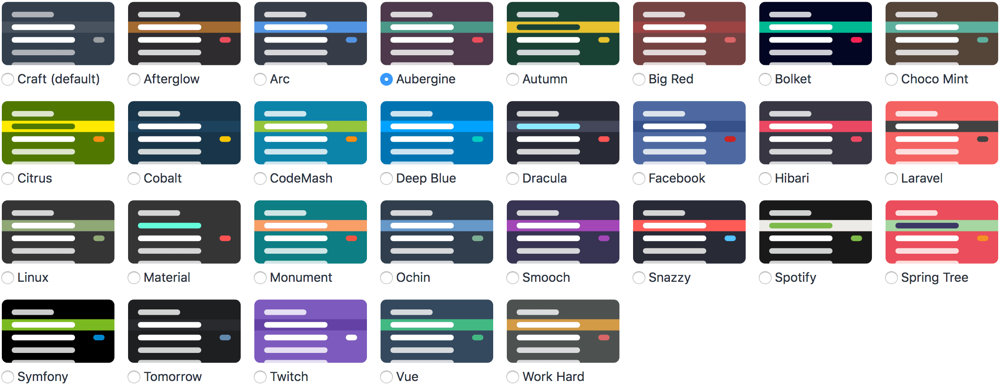

# Sidebar Themes plugin for Craft CMS 3

Customise the look of the CP sidebar



## Requirements

This plugin requires Craft CMS 3.0.0 or later.

## Installation

To install the plugin, either install via the plugin store or follow these instructions.

1. Open your terminal and go to your Craft project:

        cd /path/to/project

2. Then tell Composer to load the plugin:

        composer require lukeyouell/craft-sidebarthemes

3. In the Control Panel, go to Settings → Plugins and click the “Install” button for Sidebar Themes.

## Using Sidebar Themes

To switch themes simply go to the plugin settings page.

## Overriding Plugin Settings

If you create a config file in your `config` folder called `sidebar-themes.php`, you can override the plugin’s settings in the Control Panel. Since that config file is fully multi-environment aware, this is a handy way to have different settings across multiple environments.

Here’s what that config file might look like:

```twig
<?php

return [
    'theme' => 'cobalt',
];
```

## Available Themes

A list of the available themes are available [here](THEMES.md)

## Sidebar Themes Roadmap

Some things to do, and ideas for potential features:

- Custom colour schemes
- Ability to give users the option to choose their own theme
- More themes!

Brought to you by [Luke Youell](https://github.com/lukeyouell)
